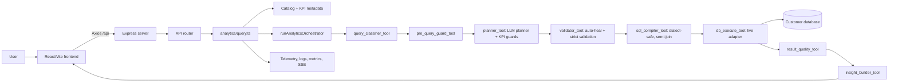

# ANONYMOUS_AI: Complete Workflow and Code Map

This document explains the current project from startup to shutdown and from a user question to the final chart. It is based on the code under `ANONYMOUS_AI/backend/src`, `ANONYMOUS_AI/backend/migrations`, and `ANONYMOUS_AI/frontend/src`.

The repository folder is named `ANONYMOUS_AI` (uppercase). The application is a full-stack semantic-layer analytics system: users register database connections, the backend introspects their schemas, users define governed KPIs, and natural-language questions are converted into validated parameterized SQL.

## 0. Current state / recent changes (latest)

The execution engine is a single orchestrator (`runAnalyticsOrchestrator`) with **two selectable tool-ordering strategies** via `ANALYTICS_ORCHESTRATOR_MODE`: **`deterministic`** (default) — backend code follows each tool's `next` pointer, spending only the planner's ~1 LLM call; and **`agent`** — a LangGraph ReAct agent chooses each tool (~1 LLM call per tool, heavier on quota). Both run the same eight tools, guards, and deterministic response assembly. This replaced the older separate KPI/Simple pipelines. Recent hardening (see `CompleteFixes.txt` Parts 10–16 for detail):

- **Authenticated per-connection semantic-model cutover (2026-08-03):**
  `autonomous_db` is the authoritative metadata database; HttpOnly hashed
  sessions and admin/user roles now own audit identity; connections have stable
  semantic keys; and `semantic_models` stores one revisioned JSON document per
  connection. Selected-table full generation, missing-only append, one-table
  regeneration, no-LLM removal, revision-safe editing, and vector repair use the
  `/api/semantic-models/:connectionId` contract. Local Qdrant is the fixed derived
  vector store, local Ollama supplies 768-dimensional embeddings, and a durable
  outbox handles retries and connection deletes. `WORKFLOW.md` is the focused operating
  guide for this flow.

- **Clean baseline and authenticated entry:** new installations apply one complete
  `001_init.sql` baseline. The runtime has exactly 14 metadata tables; setup-only
  copy audit storage and unused legacy KPI columns are absent. `LoginGate.jsx`
  prevents the application shell from rendering before authentication.
- **Semantic-model-routed Dashboard AI:** the retired Summary storage fields,
  tab, API, and generator no longer exist.
  `semanticModelConnectionRouter.ts` validates ready per-connection semantic
  documents and ranks only bounded business names/descriptions; physical table and
  column identifiers are excluded from routing context. Analytics AI and
  Observability remain implemented, but their frontend tabs and routes are
  currently commented out.
- **Dashboard AI:**
  `POST /api/assistant/ask` adds semantic-model routing before the existing
  engine. Ambiguous score gaps return safe source cards; confident routes create
  a separate lazy, sticky Dashboard conversation. The original company
  Dashboard layout is preserved; its prompt and history control open a contained
  overlay that reuses the exported analytics result card/chart/trace view,
  attributes its source, and can explicitly re-route. `/Analytics` now
  redirects to `/`.
- **Intent-based Simple scoping + table roles:** `selectRelevantDatasets()`
  ranks every table by question-token overlap (with singular stemming so
  "cases" matches `*_CASE`), pulls the relevant cluster + FK neighbours, and
  deprioritises backup/archive copies, replacing the old blind first-N slice.
  `analytics/pipelines/simple/datasetRole.ts` classifies each table
  (entity/backup/report/log/lookup) — used by scoping and the planner prompt.
  Wide tables are then
  column-pruned (`ANALYTICS_CATALOG_PRUNE_THRESHOLD`/`_MAX_COLUMNS`).
- **Safe entity listings:** vague requests such as “what are the cases?” still
  use the mandatory planner to choose the live dataset, then receive a compact
  catalog-approved projection (identifier, description, state, priority, and
  owner when available). Validator and compiler guards prohibit dataset-only
  raw plans and analytics `SELECT *`; shared result headers humanize the actual
  selected column names in both Analytics AI and the unchanged Dashboard shell.
  Explicit record verbs take precedence over partial KPI matches made only from
  generic entity/status words: “list the high priority cases that are resolved”
  stays Simple, survives a hostile KPI-shaped planner response, and receives
  catalog-grounded `priority = High` plus `state = Resolved` filters. Exact weak
  “show <full KPI name>” phrasing and aggregate/count questions remain KPI
  requests.
- **Observability:** the LLM token-usage "Recent provider calls" table is
  paginated and simplified; the live-trace list merges SSE + polled logs into
  one deduplicated, stable list (no more count flip) and the latency chart no
  longer re-animates each poll.
- **Conversation continuity (Part 12):** the frontend creates a DB-backed
  conversation before its first query, reuses and persists that ID, renews
  expired IDs, and the backend rejects cross-connection conversation use.
- **HTTP/API security (Part 12):** query-string API keys are limited to the
  native SSE stream, sensitive URL fields are redacted in HTTP logs, and
  telemetry export uses an authenticated Axios/blob download.
- **OpenAPI accuracy (Part 12):** the live route inspector documents the real
  KPI and analytics fields, correct response shapes/statuses, and route-specific
  security.
- **Providers:** Groq (default, reliable), OpenRouter, and NVIDIA NIM, plus a generic OpenAI-compatible `LLM_BASE_URL` escape hatch. Cerebras was removed.
- **KPI safety guards** run at three checkpoints: the configured `dimensions` are a strict group-by allowlist; group-by AND filter columns ambiguous across a KPI's involved tables are only trusted when the user's question names the table, else a disambiguation prompt is returned.
- **Deterministic KPI calendar periods:** explicit month/year wording such as
  `Nov 2025` or `December -2025` becomes an inclusive `between` filter on the
  KPI’s configured date dimension before planning, so model variability cannot
  turn a period request into an all-time scorecard.
- **SQL fan-out fix:** a table joined only to filter on it collapses to a `WHERE EXISTS` semi-join (its filters pushed inside), preventing COUNT/SUM inflation when the join key is non-unique.
- **Certified-KPI routing:** an exact certified-metric name is always compiled through the KPI profile (pinned datasets/joins/filters); the Simple compiler rejects a certified metric name instead of treating it as a column.
- **Error labeling:** LLM-provider failures (402/403/429, "provider returned error", parse errors, "Request timed out") are labeled AI-service errors, never database errors.
- **Dead code removed:** `config/featureFlags.ts`, `catalog/cache.ts`, `analytics/contextBuilder.ts`, `analytics/executor/simpleQueryExecutor.ts`, `connections/parseHostPort.ts`, and `src/index.ts` no longer exist — ignore any older reference to them.

## 1. Architecture in one view



There are two databases conceptually:

1. The metadata MySQL database stores connections, encrypted credentials, KPI definitions, persistent conversations, execution logs, connector metrics, latency samples, and migration history.
2. A customer/live database is accessed through an adapter created from the selected connection. Analytics SQL is executed there; the customer database is not the metadata store.

## 2. Startup, configuration, and shutdown

### Startup sequence

1. `backend/src/main.ts` is the runtime entry point. It imports the Express app and metadata pool.
2. `validateDbConnection()` retries `SELECT 1` with exponential backoff. A failed metadata check is logged as a warning; the server can still start so health endpoints can expose the problem.
3. `bootstrap()` starts the app on `PORT`, default `3005`.
4. A telemetry cleanup timer runs periodically and is unreferenced so it does not keep Node alive.
5. `backend/src/server.ts` creates middleware, mounts the API router and dynamic
   Swagger/OpenAPI endpoints, and exposes health/readiness endpoints.
6. `shutdown(signal)` closes live adapter pools, shared connector pools, metadata resources, and the application pool before exiting.

### Configuration

Configuration is read directly from environment variables at the point of use
(the former `config/featureFlags.ts` was removed as unused indirection).
Important settings include `DB_*`, `PORT`, `PUBLIC_API_BASE_URL`, `API_KEY`,
`LLM_PROVIDER`, provider API keys/models, `CONNECTION_SECRET_KEY`,
`MAX_QUERY_LIMIT`, `MAX_CONVERSATIONS`, `RESULT_CACHE_MAX_ENTRIES`,
`DATE_INPUT_ORDER`, `REDIS_URL`, `CORS_ORIGIN`, circuit-breaker/cache tunables,
and telemetry limits. The frontend reads `VITE_BACKEND_URL`, `VITE_API_KEY`,
observability polling settings, and theme configuration.

## 3. Metadata database lifecycle

The migration runner is `backend/scripts/migrate.ts`. It creates/uses
`schema_migrations`, reads SQL files in filename order, skips applied files,
executes statements, and records success. The migration directory now contains
only `001_init.sql`, a complete current-schema baseline for blank databases.
Future changes start at `002`; do not rebuild historical transitional migrations.

`test:schema` creates a temporary blank database, applies the baseline, verifies
the exact 14-table runtime schema, and removes the temporary database.
`verify:schema` applies the same structural contract to the configured database.

`backend/src/db/connection.ts` exposes a lazy proxy around the MySQL pool. `backend/src/utils/secretCrypto.ts` encrypts credentials using AES-256-GCM. `enc:v2` uses PBKDF2 with a per-secret salt; legacy plaintext and `enc:v1` values remain readable for migration compatibility. `decryptConnectionSecrets()` produces a usable connection object only at the point it is needed.

## 4. Connection and semantic-layer workflow

### Create and test a connection

The frontend `DatabaseConnections.jsx` collects type, host, port, database/schema, username, password, and provider-specific credentials. `api/services.js` calls `POST /api/connections`. The backend route validates the payload, encrypts secrets, writes `db_connections`, and returns safe metadata without exposing credentials.

Creating a connection performs a driver handshake before saving it.
`GET /api/connections/:id/health` performs the lightweight health check for an
existing saved connection. `connectionTester.ts` contains the dialect-specific
verification helpers and `parseHostPort()` supplies safe default ports.

### Build the catalog

`GET /api/data-catalog/:connectionId` is handled by `dataCatalog.ts`:

1. Load and decrypt the connection.
2. Build or reuse a live adapter/pool.
3. Run dialect-specific metadata queries.
4. Normalize tables, views, columns, functions, and relationships into common catalog types.
5. Metadata/catalog caching and eviction live in `routes/semanticLayer/dataCatalog.ts` (keyed per connection, evicted on connection delete).

Supported metadata connectors include MySQL/MariaDB, PostgreSQL/Redshift, SQL Server, SQLite, Snowflake, BigQuery, Databricks, MongoDB, and Redis. MongoDB and Redis are catalog-only in Analytics AI; they do not run SQL analytics.

`semanticModels.ts` turns raw catalog rows and KPI rows into the LLM-facing `AiCatalogContext`. `buildAiCatalog()` infers number/date/string types, marks fields as selectable/filterable/groupable, removes sensitive-looking fields, adds KPI definitions, and builds a relationship graph. The semantic-model route returns this representation for inspection and validation.

### Define a KPI

`KpiDefinitions.jsx` provides the UI for formula, format, department, dimensions, selected columns, filters, involved tables, and a rooted join tree. Filters begin as a real `null`/no-filter state; selecting **Create Filters** opens the recursive AND/OR editor. Top-level conditions and groups are siblings under the root connector, nested groups always begin with a condition, incomplete drafts are blocked, and SQL null intent uses explicit `IS NULL`/`IS NOT NULL` operators with no value field. `FilterRow`, `FilterGroupCard`, `renderAST`, and `buildFilterSummary` manage that AST. `JoinBuilder` exposes separate **Add Join From Root** and **Add Child Join** actions, keeps every edge parent-aware, combines multiple ON conditions with AND, prevents cyclic/disconnected joins, and removes only the selected branch and its descendants.

The backend `kpiMetrics.ts` validates and persists the definition. It checks formula safety with `validateSqlExpression()`, confirms columns exist in the live catalog, validates join topology, and stores JSON fields. A KPI is a governed semantic contract: its metric formula, base tables, and joins are pinned when a question later matches it.

## 5. Exact analytics request flow

The admin request is `POST /api/analytics/query`, mounted by
`semanticLayer/analyticsQuery.ts` and implemented by `analytics/query.ts`. The
Dashboard request is `POST /api/assistant/ask`, implemented by
`routes/assistant.ts`. Both call `executeResolvedAnalyticsQuery()` after one
connection has been resolved, so catalog loading, adapter construction, circuit
handling, orchestration, telemetry, and cleanup have one implementation.

### Request preparation

1. `authMiddleware.requireAuth()` checks the configured API key.
2. The router applies rate limiting to analytics and observability groups.
3. Correlation middleware assigns a trace ID using `AsyncLocalStorage`.
4. The request body is validated by the analytics schema. Invalid input becomes a sanitized API error.
5. Connectionless requests still call `planSimpleQuery()` with an empty catalog,
   so greetings/help/date-time requests and connection requirements have a
   mandatory LLM semantic entry.
6. A data request must include `connectionId`.
7. The handler loads the connection and validates that any supplied
   `conversationId` is unexpired and belongs to that connection. A missing,
   expired, or cross-connection ID returns `409 CONVERSATION_UNAVAILABLE`; the UI
   creates a replacement and retries once.
8. The handler decrypts secrets, creates an auth context, loads KPI rows, and
   builds the current AI catalog.
9. NoSQL-only connections and catalogs with no executable datasets are rejected
   with a user-facing response.
10. The connection circuit breaker is checked before expensive planning or
    database work. Valid conversation context includes the last answer and recent
    table/column hints for follow-up resolution.

### Dashboard connection routing

1. The assistant loads only SQL connections with a ready, non-empty semantic-model
   document and a closed circuit.
2. A sticky `user_conversations.connection_id` bypasses routing for ordinary
   follow-ups. Explicit re-route removes the old connection from the eligible
   pool so “wrong source” cannot immediately pick it again.
3. `rankConnections()` sends only safe IDs, labels, and bounded business context
   from schema-validated semantic models to a strict structured-output model seam.
   Physical table names and column names are excluded.
4. Low scores return a `needs_connection` response. A close top-two score gap
   returns `connection_selection_required` cards containing only
   `{connectionId, label, context}`.
5. A confident candidate runs `executeResolvedAnalyticsQuery()`. Only a
   setup-level unavailable result can try the next above-threshold candidate;
   planner, validator, and data-quality results stay on the selected source.
6. After routing, the request lazily creates/pins a Dashboard conversation,
   persists compact messages, and tags telemetry with `dashboard-ai` plus the
   routed connection.
7. Dashboard responses prepend three trace entries before the normal tool chain:
   `intent_connection_router` states whether a semantic model, sticky
   conversation, or explicit choice selected the connection;
   `live_schema_introspection` reports the executable datasets/column counts
   loaded from live connector metadata; and `schema_decision` explains the
   validator-approved datasets, metric, and column references. These entries are
   never added to the admin Analytics AI response.

### Semantic-model routing context

`analytics/router/semanticModelConnectionRouter.ts` reads ready documents from
`semantic_models`, validates each document with `SemanticModelDocumentSchema`, and
builds a bounded routing context from the model name, domain, description, entity
business names/descriptions, dimension names, and measure names. Invalid or
non-ready documents are not eligible. This lets the Dashboard route by governed
business meaning without restoring a second Summary lifecycle or exposing physical
database identifiers.

### Intent-based Simple scoping and table roles

For non-KPI questions on a wide schema, `planSimpleQuery()` no longer sends an
arbitrary first-N slice. `selectRelevantDatasets()` scores every table by
overlap between the question tokens (singular-stemmed, so "cases" matches
`*_CASE`) and the table's name/synonyms/columns, keeps the top cluster plus its
FK neighbours (up to `MAX_SCOPED_DATASETS`), and applies `datasetRolePenalty()`
so a backup copy can never outrank the live table it duplicates. Explicit
mentions and recent-conversation tables still win. The scoped catalog is then
column-pruned before the planner prompt, and each table carries its `role` +
`note` so the LLM prefers the canonical **entity** table over its backup or
report. Only when nothing scores does it fall back to a capped, `truncated`
slice that asks the user to name the table.

### Routing decisions

`queryClassifier.ts` is heuristic and does not call the LLM. It is now invoked by `query_classifier_tool`, the first tool in the shared orchestrator. `scoreKpiMatch()` compares exact KPI names, tokens, synonyms, and phrase overlap and selects either the certified KPI profile or the Simple profile.

The result is one of these practical paths:

| Condition                 | Result                                                  |
| ------------------------- | ------------------------------------------------------- |
| Greeting/help             | LLM-planned informational response                      |
| Date/time                 | LLM-planned current date/time response                  |
| Technical catalog request | Generic metadata-protection response after LLM planning |
| Business KPI-list request | Allowed KPI-list response                               |
| Ambiguous field/date      | Clarification response; no SQL execution                |
| Certified KPI match       | Shared orchestrator selects the KPI profile             |
| Ordinary data question    | Shared orchestrator selects the Simple profile          |
| Uncertified aggregate     | KPI-required response                                   |
| Write intent              | Unsupported-intent response                             |

All executable KPI and Simple requests now enter `runAnalyticsOrchestrator()`. The former linear agents and dormant legacy ReAct implementation have been removed.

## 6. Analytics orchestrator (deterministic or agent tool ordering)

The orchestrator exposes these backend-controlled tools:

`query_classifier_tool`, `pre_query_guard_tool`, `planner_tool`, `validator_tool`, `sql_compiler_tool`, `db_execute_tool`, `result_quality_tool`, and `insight_builder_tool`.

Tool calls are recorded in actual invocation order. Validation, compilation, and execution prerequisites are enforced by authoritative backend state, so the LLM can retry and branch but cannot skip safety gates or supply arbitrary SQL.

The orchestrator prompt requires one tool call per model turn. As a second, deterministic protection, `runRecordedTool()` chains every invocation through a per-run promise queue. LangGraph can dispatch multiple tool calls from one model response concurrently; the queue prevents those calls from racing over shared state and executes them in the exact order the model emitted them.

### Orchestrator run state and trust boundary

`runAnalyticsOrchestrator()` creates one isolated state object per request. It contains the execution ID, question, requested mode, cloned catalog, configured KPIs, live adapter, request filters, conversation context, selected profile, matched KPI, date notes, plan versions, compiled query, result rows, quality result, insight, chart, corrections, attempt counters, chronological trace, retry feedback, and any terminal response.

The state object is captured by the tool implementations and is not given to the LLM as editable JSON. Tool responses only expose small status summaries such as the selected profile, plan version, dataset names, parameter count, row count, retryability, and recommended next tool. This creates the core trust boundary:

- The model can choose which tool to request next.
- The model cannot inject an arbitrary plan into validation; `planner_tool` owns the current plan.
- The model cannot provide or edit SQL; `sql_compiler_tool` owns `CompiledQuery`.
- `db_execute_tool` accepts only the compiled query stored for the currently validated plan version.
- Re-planning increments the plan version and invalidates validation, SQL, data, quality, insight, and chart state from the previous version.
- A terminal clarification, unsupported intent, data-quality response, or completed insight blocks later tool calls.

### Tool-by-tool execution

| Tool                    | Preconditions                                     | Work performed                                                                                                                                                                                                                                                                                                                                                               | Normal next action                                                                                                  |
| ----------------------- | ------------------------------------------------- | ---------------------------------------------------------------------------------------------------------------------------------------------------------------------------------------------------------------------------------------------------------------------------------------------------------------------------------------------------------------------------- | ------------------------------------------------------------------------------------------------------------------- |
| `query_classifier_tool` | None; must be first                               | Calls deterministic `classifyQuery()`. Honors explicit Simple mode, otherwise selects KPI when a certified metric matches and Simple for ordinary catalog queries. Stores matched KPI and deterministically extracted user filters.                                                                                                                                          | `pre_query_guard_tool`, or terminal assistant/ambiguity response                                                    |
| `pre_query_guard_tool`  | Classification/profile exists                     | Calls `detectWriteIntent()` and `analyzeLocalDateInputs()`. Blocks mutations and asks for clarification when a local date is ambiguous.                                                                                                                                                                                                                                      | `planner_tool`                                                                                                      |
| `planner_tool`          | Guard passed                                      | Calls the KPI or Simple planner for every request. On retries it includes sanitized feedback from validation, compilation, or execution. For KPI grouping, configured dimensions are enforced as an allowlist: one short-name match resolves to its qualified dimension, multiple matches clarify, and zero/external qualified matches terminate with a KPI-update response. | `validator_tool`, or terminal dimension/ambiguity/informational response                                            |
| `validator_tool`        | Current plan exists                               | Calls `sanitizeAndCorrectPlan()`, merges/deduplicates request filters, adds date notes, pins certified KPI fields, and calls `validatePlan()`. Simple mode uses `allowDynamicMetrics: false`.                                                                                                                                                                                | `sql_compiler_tool`; retryable failures return to `planner_tool`; uncertified aggregates terminate with `NEEDS_KPI` |
| `sql_compiler_tool`     | Current plan version passed validation            | KPI profile calls `compileKpiQuery()` with the certified expression and KPI filter/join AST. Simple profile calls `compileSimpleSelectQuery()`. Both produce parameterized SQL through catalog-based identifier resolution.                                                                                                                                                  | `db_execute_tool`; compiler feedback can return to `planner_tool`                                                   |
| `db_execute_tool`       | Compiled plan version equals current plan version | Calls the selected `LiveAdapter.execute()` and caps exposed rows to `MAX_QUERY_LIMIT`. Database errors are sanitized before becoming retry feedback.                                                                                                                                                                                                                         | `result_quality_tool`; retryable failure can return to `planner_tool`                                               |
| `result_quality_tool`   | Validated plan, compiled SQL, and data exist      | Calls `evaluateGroupedResultQuality()`. All-blank grouping values create a blocking data-quality response; partial blanks become visible corrections.                                                                                                                                                                                                                        | `insight_builder_tool` or terminal data-quality response                                                            |
| `insight_builder_tool`  | Quality check completed                           | Calls `buildInsight()`, applies visible date interpretation notes, adds row-limit warnings, and stores the answer/chart.                                                                                                                                                                                                                                                     | Terminal successful state                                                                                           |

### Normal successful end-to-end sequence

1. The route completes authentication, request validation, connection/catalog setup, circuit-breaker checks, and conversation-context loading.
2. `runAnalyticsOrchestrator()` clones request context into isolated backend state and creates the eight tools as closures over that state.
3. Tool ordering starts at `query_classifier_tool` and then follows each tool's structured `next`/retry/terminal decision. In `deterministic` mode `runDeterministicOrchestrator()` (backend code) advances the chain; in `agent` mode `createReactAgent()` (LangGraph) is invoked with the configured model and the LLM picks each next tool.
4. The deterministic classifier selects `kpi` or `simple` and stores any matched KPI.
5. The guard tool rejects writes or ambiguous dates before planning or SQL work.
6. The planner creates plan version 1 (its structured output; in `agent` mode a compact summary is also returned to the agent).
7. The validator sanitizes and verifies version 1. The validated-version marker must equal the current plan version.
8. The compiler generates parameterized SQL and records that it belongs to validated plan version 1.
9. The database tool executes that exact compiler-owned object. The LLM never receives authority to replace its SQL or parameters.
10. Result quality is evaluated before any chart or business narrative is produced.
11. The insight tool stores the final answer and chart and reports terminal completion.
12. `finalizeResponse()` constructs the API payload deterministically from state: `mode`, KPI used, corrections, plan/semantic match, compiled SQL, rows, insight, chart, and chronological trace. (In `agent` mode the agent's final text is only a completion signal and is ignored.)
13. `analytics/query.ts` updates successful conversation history, records circuit-breaker success/failure, writes execution telemetry and metrics, sets the route-level execution ID, closes the adapter, and sends the JSON response.

### Retry, branch, and terminal behavior

- A validator, compiler, or database failure stores sanitized feedback and recommends `planner_tool`. A new plan invalidates every downstream artifact before the run continues.
- `ANALYTICS_PLANNER_MAX_ATTEMPTS` limits initial planning plus re-planning. `ANALYTICS_DB_MAX_ATTEMPTS` limits database execution attempts across the complete request.
- `ANALYTICS_ORCHESTRATOR_MODE` selects who picks the next tool. `deterministic` (default): backend code follows each tool's `next` pointer with no extra LLM call — a request spends only the planner's ~1 LLM call. `agent`: a LangGraph ReAct agent selects each tool (guided by each tool's authoritative `next`/`retryable`/`terminal` result), so a request makes roughly one LLM call per tool (~8) — materially more provider quota. Any other value is rejected as a configuration error. `ANALYTICS_ORCHESTRATOR_MAX_TOOL_CALLS` limits total tool invocations in both modes; `ANALYTICS_ORCHESTRATOR_RECURSION_LIMIT` bounds the agent loop.
- A tool called before its prerequisite returns a structured failure and recommends the required tool. It does not execute unsafe work.
- Write intent, date clarification, planner ambiguity, informational catalog answers, `NEEDS_KPI`, blocking result quality, attempt exhaustion, and completed insight are terminal outcomes.
- If orchestration stops early or a provider/tool error prevents completion, `finalizeResponse()` returns a controlled resilient error rather than partial or model-fabricated analytics data.

### Trace format

Every invocation appends an entry in real call order:

```json
{
  "step": "validator_tool",
  "status": "completed",
  "detail": "Validated plan version 1.",
  "attempt": 1,
  "durationMs": 8
}
```

Retries remain separate entries. The frontend execution-trace panel renders tool name, status, attempt, duration, and detail. There is no `ORDERED_TRACE_STEPS` array and no post-processing that makes a retried/branched run look linear.

### KPI mode

The classifier tool selects a matched KPI, after which `planner_tool` calls `planKpiQuery()` when semantic planning is needed. The tool runtime overwrites the plan's metric, datasets, and joins with the certified KPI definition. The LLM may add grouping, filtering, sorting, and limits, but cannot redefine the KPI.

`toQueryPlanFilters()`, `normalizeDatasetRef()`, and `filterKey()` normalize request filters and remove duplicates. Validation then auto-heals safe omissions, strictly verifies the final plan, compiles it, executes it with a timeout, checks grouped result quality, and builds the response.

### Simple mode

For non-KPI questions, `planner_tool` calls `planSimpleQuery()`, which proposes datasets, columns, joins, filters, grouping, sorting, and limits from a scoped catalog. `pre_query_guard_tool` blocks mutations, while `validator_tool` refuses uncertified ad-hoc totals/averages where the product requires a governed KPI.

### LLM planning

`analytics/planner/index.ts` creates Groq, OpenRouter, NVIDIA NIM, or a generic OpenAI-compatible client through `getLlmModel()`. (Cerebras was removed.) All non-Groq providers use the OpenAI-compatible `ChatOpenAI` with a provider base URL: OpenRouter (`https://openrouter.ai/api/v1`, optional attribution headers), NVIDIA NIM (`https://integrate.api.nvidia.com/v1`), or a custom `LLM_BASE_URL`. **Groq (`llama-3.3-70b-versatile`) is the reliable default** — it planned every verification query correctly and consistently. NVIDIA's free fast model (`meta/llama-3.1-8b-instruct`) is quick but plans inconsistently; NVIDIA's 70B is capable but the free tier queues/times out. `LlmRateLimiter` enforces per-provider concurrency and minimum intervals for structured-output and bound-tool calls. Model selection happens only through `LLM_PROVIDER` and that provider's model setting. Both orchestration modes (the `agent`'s tool selection and, in either mode, the semantic planners) always reuse this single configured model.

OpenRouter free usage is suitable for development rather than guaranteed production capacity. The backend defaults to `OPENROUTER_MIN_INTERVAL_MS=3200` and one concurrent call to stay below OpenRouter's current 20 requests/minute free limit. Account-wide daily limits and upstream provider saturation still apply. The pinned default avoids random model changes, but no free model can promise zero rate-limit responses.

To activate OpenRouter after creating a key:

```env
LLM_PROVIDER=openrouter
OPENROUTER_API_KEY=replace-with-your-key
OPENROUTER_MODEL=nvidia/nemotron-3-super-120b-a12b:free
OPENROUTER_BASE_URL=https://openrouter.ai/api/v1
OPENROUTER_MIN_INTERVAL_MS=3200
OPENROUTER_MAX_CONCURRENT=1
```

The backend `.env` and `.env.example` expose the orchestration mode plus safety bounds. No second model can be configured — both modes reuse the one provider/model from section 3:

```env
ANALYTICS_ORCHESTRATOR_MODE=deterministic   # or: agent
ANALYTICS_ORCHESTRATOR_RECURSION_LIMIT=30
ANALYTICS_ORCHESTRATOR_MAX_TOOL_CALLS=18
ANALYTICS_PLANNER_MAX_ATTEMPTS=3
ANALYTICS_DB_MAX_ATTEMPTS=2
SHOW_LLM_TOKEN_USAGE=false
LLM_CONTEXT_WINDOW_TOKENS=128000
```

LLM usage is always captured in the bounded live telemetry buffer. The
company-safe `SHOW_LLM_TOKEN_USAGE=false` default hides token events from
Observability APIs, SSE, exports, and the frontend; setting it to `true` exposes
them after a backend restart. Context utilization uses
`LLM_CONTEXT_WINDOW_TOKENS`, with optional
`<PROVIDER>_CONTEXT_WINDOW_TOKENS` overrides.

## 7. Plan healing, validation, and SQL generation

`validatePlan.ts` has two phases:

1. `sanitizeAndCorrectPlan()` clones and normalizes the plan, resolves fuzzy dataset/column references, creates missing relationship joins with graph traversal, normalizes filters, creates dynamic aggregate metrics when allowed, validates raw `select_columns`, deduplicates datasets, clamps the limit to `MAX_QUERY_LIMIT`, and requires an explicit projection for Simple raw-record execution.
2. `validatePlan()` verifies dataset/column existence (including every projected column), relationship connectivity, metric expression safety, filter validity, join correctness, and limit bounds. Failures use typed `SqlCompileError`/error codes.

`sql/compiler.ts` is the final SQL trust boundary. `isSafeIdentifier()`, `quoteId()`, and `paramPlaceholder()` enforce identifier and dialect rules. `SafeSqlBuilder` accumulates SQL and parameters. `compileFilterSql()` and `compileFilterLogic()` reject raw SQL filter nodes and compile structured conditions. `resolveRelativeTime()` handles relative date windows. `compileKpiQuery()` and `compileSimpleSelectQuery()` produce `CompiledQuery` objects with SQL, parameters, dialect, selected metric, datasets, and joins. Both compilers reject an empty SELECT projection; user analytics SQL never falls back to `SELECT *`.

The compiler supports dialect-specific quoting/placeholders and parameter binding for MySQL/MariaDB, PostgreSQL/Redshift, SQL Server, SQLite, Snowflake, BigQuery, and Databricks. Join generation uses catalog relationships; existence-only joins can become `WHERE EXISTS` to avoid aggregate fan-out. Only the current structured KPI filter model is supported; the removed raw legacy inclusion/exclusion fields are not stored.

## 8. Execution, caching, and resilience

`buildLiveAdapter()` chooses the driver and creates a `LiveAdapter`. `adapterPoolRegistry.ts` caches adapters, touches activity, evicts idle pools, tracks pending closes, and closes everything during shutdown. `poolManager.ts` performs equivalent reuse/cleanup for MySQL, PostgreSQL, MSSQL, and Mongo clients.

`withTimeout()` wraps execution with the configured timeout (30 seconds in the analytics path) via `Promise.race` so it rejects on every dialect. The `db_execute_tool` runs the compiled query through the `LiveAdapter` and normalizes rows. `resultCache.ts` supports Redis when `REDIS_URL` exists and an in-memory capped fallback otherwise; invalidation uses Redis `SCAN` rather than an O(N) `KEYS` scan.

The in-memory circuit breaker (`circuitBreaker.ts`) moves through closed/open/half-open states, supports a single probe, counts failures/successes, and uses cooldown/decay thresholds. `redisCircuitBreaker.ts` persists equivalent state with deployment-scoped keys and Lua operations when Redis is configured.

## 9. Response construction and telemetry

`resultQuality.ts` blocks results where every group value is blank/null and warns on partial missing labels. `insightBuilder.ts` creates:

```json
{
  "insight": { "answer": "...", "drivers": [], "followUps": [] },
  "chart": { "type": "bar|line|scorecard", "data": {} }
}
```

Charts are omitted for plain lists or uniform values. `responseBuilders.ts` creates clarification and unsupported-intent payloads. The orchestrator's `runRecordedTool()` wrapper records every real tool invocation, including retries and prerequisite failures.

`telemetry/correlation.ts` provides `correlationMiddleware()` and `getTraceId()`. `inMemoryLogs.ts` records bounded live events and atomically persists a cache file. `telemetryStore.ts` records execution logs, connector metrics, latency samples, reads/filter/exports them, and cleans old telemetry. `observability.ts` exposes logs, CSV/JSON export, metrics, latency, live events, and breaker state. `observability-sse.ts` streams live events to the frontend.

`telemetry/llmUsage.ts` normalizes actual provider usage metadata for every
centrally wrapped LLM call, records input/output/total tokens, stage, latency,
status, provider/model, and calculated context-window percentage, and aggregates
the bounded events for `GET /api/observability/token-usage`. The visibility flag
also filters LLM token events out of live-log responses, CSV exports, and SSE.

## 10. Frontend flow

`frontend/src/main.jsx` mounts React, Redux, the theme provider, authentication,
and `LoginGate`. Until session discovery or login succeeds, only the theme-matched
sign-in screen renders. `App.jsx` then defines routes and lazy-loads heavy pages
with chunk-load retry handling. `withRouteBoundary()` wraps each route in
`ErrorBoundary` so a page failure does not destroy the shell.

### Routes and screens

| Route                      | Component             | Purpose                                                                                |
| -------------------------- | --------------------- | -------------------------------------------------------------------------------------- |
| `/`                        | `Dashboard`           | Original company Dashboard; AI chat/history opens in an overlay                        |
| `/Analytics`               | redirect              | Compatibility redirect to `/`; old Redux page retired                                  |
| `/Layer`                   | `SemanticTab`         | Semantic-layer layout                                                                  |
| `/Layer/DBConnections`     | `DatabaseConnections` | Connection CRUD/test                                                                   |
| `/Layer/SemanticModels`    | `SemanticModelManager`| Per-connection semantic-model generation/review                                        |
| `/Layer/KPIMetrics`        | `KpiDefinitions`      | Governed KPI builder                                                                   |

`AnalyticsAssistant` and `ObservabilityDashboard` remain in the source tree, but
their tab entries, lazy imports, and routes are currently commented out.

The Semantic Model screen presents the selected connection first, the authoritative
Semantic JSON immediately below it, and then a responsive two-column workspace for
the live table/view picker and the independently scrollable Modeled Entities list.

`Header`, `Sidebar`, `Footer`, `FilterPanel`, `TabsHeader`, `Loading`, `InlineState`, and `ErrorBoundary` form the shared shell and loading/error states. `ThemeContext`, `useThemeColor`, `theme.json`, and `index.css` provide CSS-variable theme tokens.

### API and state

`api/services.js` owns Axios calls: `runQueryAPI`, `askAssistant`,
Dashboard-conversation read/delete, connection and KPI CRUD, semantic-model
methods, admin conversation lifecycle, analytics
queries, and observability methods. Read requests retry transient 408/429/5xx
errors; `getApiErrorMessage()` converts backend errors to display text.

`catalogStore.js` caches catalogs per connection in local storage with a five-minute TTL and invalidates unsafe/error responses. `analyticsSlice.js` stores analytics state in Redux; `store.js` configures the store. `asyncState.js` defines loading/error helpers. `storageKeys.js` scopes query history by connection. `safeText.js` strips unsafe control characters before rendering JSON/text.

### Analytics chat rendering

`AnalyticsAssistant.jsx` creates a backend conversation before the first question,
reuses its ID for follow-ups, persists that ID with local history, resets it when
the selected connection changes, and renews it when the backend reports expiry.
Deleting one history entry calls the connection-owned backend delete and removes
the matching local entry; Clear History deletes all persisted conversations for
the selected connection. Both require confirmation, preserve local state when
the server call fails, and reset the open chat when its conversation is deleted.
It renders the business answer/chart plus Data, SQL, Raw, and Trace development
tabs. `AssistantResultCard` displays the backend response and follow-ups.
`RenderChart.jsx` transforms chart specifications into Chart.js/Recharts visuals,
handles grouped data and month/year labels, and suppresses meaningless charts.

`Dashboard.jsx` keeps the original company landing markup and sends its prompt
into `DashboardAssistantOverlay.jsx`. The overlay has no visible connection
selector, stores conversation-centric history, renders safe connection-choice
cards, and wraps the same exported `AssistantResultCard`/`RenderChart` with
“Answered from …” attribution and an explicit re-route action. Opening and
closing it does not reflow or restyle the Dashboard.

### Observability rendering

`useObservabilityStream.js` subscribes to the SSE endpoint and keeps live logs.
Because native `EventSource` cannot set headers, that route alone accepts the API
key in its query string; server logging redacts it. `ObservabilityDashboard.jsx` merges
live/polled logs, renders latency/event details, and exports through an Axios
header-authenticated blob download. Polling interval and log limit come from Vite
environment variables. When the backend enables token visibility, it additionally
renders LLM call totals, input/output/total tokens, average/peak context use,
failed calls, stage breakdowns, and recent provider calls without changing the
existing Observability layout.

## 11. Complete source map

### Backend modules

| File                                               | Main functions/classes and responsibility                                                                                                                              |
| -------------------------------------------------- | ---------------------------------------------------------------------------------------------------------------------------------------------------------------------- |
| `main.ts`                                          | `validateDbConnection`, `bootstrap`, `shutdown`; process lifecycle                                                                                                     |
| `server.ts`                                        | Express app, CORS, body limits, request logging, health/readiness, error handling                                                                                      |
| `routes/router.ts`                                 | API mounting, auth, rate limits, conversation create/individual-delete/connection-clear endpoints                                                                      |
| `routes/swagger.ts`                                | dynamic route discovery, OpenAPI contract enrichment, Swagger UI                                                                                                       |
| `routes/semanticLayer/connections.ts`              | connection list/create/update/delete/test                                                                                                                              |
| `routes/semanticLayer/dataCatalog.ts`              | dialect-specific catalog inspection and normalization                                                                                                                  |
| `routes/semanticLayer/kpiMetrics.ts`               | KPI CRUD and structural/formula validation                                                                                                                             |
| `routes/semanticLayer/semanticCatalog.ts`          | `buildAiCatalog` and deterministic analytics semantic-catalog routes                                                                                                   |
| `routes/semanticLayer/semanticModels.ts`           | per-connection model read/generate/regenerate/remove/save/vector-retry routes                                                                                           |
| `routes/semanticLayer/userConversationStore.ts`    | lazy/pinned Dashboard conversations, compact messages, TTL and bounded cleanup                                                                                         |
| `routes/assistant.ts`                              | Dashboard ask wrapper, sticky routing, safe selection responses, unavailable-candidate fallback                                                                        |
| `routes/semanticLayer/queryClassifier.ts`          | `classifyQuery`, `scoreKpiMatch`, date extraction, ambiguity detection                                                                                                 |
| `routes/semanticLayer/conversationStore.ts`        | create/get/delete/connection-clear conversation, add messages, bounded cleanup in `conversations`/`conversation_messages`                                             |
| `routes/semanticLayer/analyticsQuery.ts`           | thin route wrapper around analytics query handler                                                                                                                      |
| `analytics/query.ts`                               | admin request validation/conversation ownership and delegation to the shared resolved engine                                                                           |
| `analytics/executeResolvedAnalyticsQuery.ts`       | shared connection/catalog/adapter/orchestrator/telemetry path for both APIs                                                                                            |
| `analytics/router/semanticModelConnectionRouter.ts`| ready semantic-model eligibility, safe bounded context, strict LLM ranking, score-gap decision, and fallback ordering                                                   |
| `analytics/router/routingEval.ts`                  | routing-accuracy and expected-table-overlap evaluation harness                                                                                                         |
| `analytics/pipelines/simple/datasetRole.ts`        | deterministic per-table role classifier (entity/backup/report/log/lookup) + `note` used by scoping and planner prompts                                                 |
| `analytics/utils/resolvers.ts`                     | dataset, column, and metric reference resolution (throws `AMBIGUOUS_MODE` on bare ambiguous columns)                                                                   |
| `analytics/planner/index.ts`                       | LLM factory, rate limiter, query-plan schemas                                                                                                                          |
| `analytics/planner/pruneCatalogColumns.ts`         | wide-table prompt pruning that preserves KPI/key/relationship columns                                                                                                  |
| `analytics/orchestrator/analyticsOrchestrator.ts`  | shared KPI/Simple orchestrator, tool registry, run state, retries, trace, final response                                                                               |
| `analytics/pipelines/kpi/kpiPlanner.ts`            | KPI prompt and relevant-dataset selection                                                                                                                              |
| `analytics/pipelines/simple/simplePlanner.ts`      | simple-query prompt and catalog selection                                                                                                                              |
| `analytics/pipelines/shared/queryUnderstanding.ts` | date ambiguity and write-intent guards                                                                                                                                 |
| `analytics/pipelines/shared/responseBuilders.ts`   | clarification, unsupported, and safe connection-selection payloads                                                                                                     |
| `analytics/pipelines/shared/resultQuality.ts`      | blank group detection and quality responses                                                                                                                            |
| `analytics/pipelines/shared/insightBuilder.ts`     | answer, drivers, follow-ups, and chart spec                                                                                                                            |
| `analytics/validator/validatePlan.ts`              | plan auto-healing and strict validation                                                                                                                                |
| `sql/compiler.ts`                                  | safe identifiers, placeholders, filters, joins, KPI/simple SQL, self-tests                                                                                             |
| `analytics/executor/buildLiveAdapter.ts`           | live driver/adaptor factory                                                                                                                                            |
| `analytics/executor/adapterPoolRegistry.ts`        | adapter cache, eviction, pending close, shutdown                                                                                                                       |
| `analytics/executor/timeoutWrapper.ts`             | `Promise.race` abort/timeout wrapper (per dialect)                                                                                                                     |
| `analytics/executor/resultCache.ts`                | Redis/in-memory result cache and invalidation                                                                                                                          |
| `connections/poolManager.ts`                       | shared MySQL/PG/MSSQL/Mongo pools and cleanup                                                                                                                          |
| `db/connection.ts`                                 | lazy metadata MySQL pool                                                                                                                                               |
| `routes/semanticLayer/dataCatalog.ts`              | live schema introspection, catalog cache, and `clearMetadataCache`/`evictCatalogPool`                                                                                  |
| `mcp/security/authMiddleware.ts`                   | API-key authorization                                                                                                                                                  |
| `mcp/security/authProvider.ts`                     | `buildAuthContext` for connector access                                                                                                                                |
| `mcp/security/rateLimiter.ts`                      | bounded in-memory request limiter and cleanup                                                                                                                          |
| `mcp/resilience/circuitBreaker.ts`                 | in-memory breaker state machine                                                                                                                                        |
| `mcp/resilience/redisCircuitBreaker.ts`            | Redis-backed breaker implementation                                                                                                                                    |
| `telemetry/correlation.ts`                         | trace ID middleware and lookup                                                                                                                                         |
| `telemetry/inMemoryLogs.ts`                        | bounded live event store and atomic cache persistence                                                                                                                  |
| `telemetry/llmUsage.ts`                            | provider usage normalization, call metering, visibility policy, and aggregation                                                                                        |
| `telemetry/telemetryStore.ts`                      | durable logs, metrics, latency, retention, exports                                                                                                                     |
| `utils/connectionTester.ts`                        | connector verification helpers                                                                                                                                         |
| `utils/errorFormatter.ts`                          | database error sanitization and friendly responses                                                                                                                     |
| `utils/secretCrypto.ts`                            | credential encryption/decryption                                                                                                                                       |
| `utils/sqlValidator.ts`                            | SQL expression safety check                                                                                                                                            |
| `utils/stringNormalizer.ts`                        | normalized string matching                                                                                                                                             |
| `utils/httpSecurity.ts`                            | query-key route allowlist and sensitive URL redaction                                                                                                                  |
| `types/types.ts`                                   | catalog, KPI, query, adapter, result, conversation, telemetry types                                                                                                    |
| `types/errors.ts`                                  | typed compiler/validator error codes                                                                                                                                   |
| `tests/regression.test.ts`                         | regression coverage for known routing/pipeline/security issues                                                                                                         |

### Frontend modules

| Area          | Files and responsibility                                                                                                                                               |
| ------------- | ---------------------------------------------------------------------------------------------------------------------------------------------------------------------- |
| Boot/config   | `main.jsx`, `App.jsx`, `vite.config.js`, `eslint.config.js`, `playwright.config.ts`                                                                                    |
| Shell         | `Header.jsx`, `Sidebar.jsx`, `Footer.jsx`, `ErrorBoundary.jsx`, `FilterPanel.jsx`                                                                                      |
| Pages         | `Dashboard.jsx`, `DashboardAssistantOverlay.jsx`, `Analytics.jsx`, `Tab.jsx`, `SemanticTab.jsx`, `TabsHeader.jsx`                                                      |
| Semantic tabs | Active: `DatabaseConnections.jsx`, `SemanticModelManager.jsx`, `KpiDefinitions.jsx`; retained but not routed: `AnalyticsAssistant.jsx`, `ObservabilityDashboard.jsx`              |
| Analytics UI  | `PromptDialog.jsx`, `BottomPromptBar.jsx`, `RenderChart.jsx`, `RenderChart.css`                                                                                        |
| API/state     | `api/services.js`, `store/store.js`, `reducers/analyticsSlice.js`, `stores/catalogStore.js`                                                                            |
| Hooks/context | `useToast.jsx`, `useThemeColor.js`, `useObservabilityStream.js`, `ThemeContext.jsx`                                                                                    |
| Utilities     | `safeText.js`, `formatters.js`, `asyncState.js`, `storageKeys.js`, `Loading.jsx`, `InlineState.jsx`                                                                    |
| Visual assets | `src/assets/*`, `public/logo.png`, `public/srm-title-logo.png`                                                                                                         |

## 12. Failure and safety behavior

- Missing/invalid API keys are rejected before route work.
- Invalid bodies, unknown identifiers, unsafe formulas, raw filters, disconnected joins, and excessive limits fail validation.
- Ambiguous dates and columns request clarification rather than guessing.
- Write-like questions are refused; analytics is read-only.
- Circuit breakers stop repeated connector failures.
- Every live query has a timeout.
- Credentials are encrypted at rest and omitted from normal API responses.
- SQLite paths are restricted to `SQLITE_DATA_DIR`.
- Telemetry and caches are bounded; idle pools are evicted.
- Backend errors are sanitized before reaching the browser.

## 13. Tests, builds, and operational commands

From `ANONYMOUS_AI/`:

```powershell
npm.cmd run build
npm.cmd run test
npm.cmd run lint
```

Backend commands include `dev`, `build`, `start`, `test`, and `migrate`. Frontend commands include `dev`, `build`, `lint`, `preview`, and `e2e`. The SQL compiler self-test covers injection rejection, identifier safety, relative dates, structured filters, joins, and parameter behavior. Regression tests cover later routing and pipeline fixes.

## 14. One complete example

For the question “What was revenue by month last year?” the runtime does this:

1. Browser sends the text, connection ID, conversation ID, and optional filters.
2. Auth, rate limit, correlation ID, and request schema checks run.
3. The backend loads the connection, KPI definitions, catalog, and conversation context.
4. Pre-query checks do not classify it as greeting/date/catalog.
5. The classifier matches a certified Revenue KPI, so KPI mode is selected.
6. The KPI planner receives only relevant catalog/KPI context and returns structured grouping/time/filter intent.
7. The plan is pinned to the certified Revenue formula/tables/joins.
8. The validator normalizes “last year”, resolves fields, verifies joins, and clamps the limit.
9. The compiler emits dialect-specific parameterized SQL; the date range is a bound parameter, not string-concatenated SQL.
10. The adapter executes with a timeout against the live database.
11. Result quality checks month labels and values.
12. The insight builder creates an answer, drivers, follow-ups, and a line chart.
13. The backend records trace/log/metric/latency data and stores a compact conversation message.
14. Axios returns JSON; `AnalyticsAssistant.jsx` renders the business answer/chart and Data, SQL, Raw, and Trace development tabs.
15. `RenderChart.jsx` formats monthly values and displays the line chart using theme colors.

For a follow-up such as “What can we group it by?”, the conversation context carries the prior KPI/table/column references into the next planner prompt, allowing “it” to resolve without the user repeating the original subject.

## 15. Current limitations noted by the codebase

- MSSQL SSL handling is less complete than MySQL/PostgreSQL SSL handling.
- Route-level, connector, and circuit-breaker integration tests could be expanded.
- Single-word KPI names can over-match; the current heuristic classifier has a documented trade-off.
- Some admin UI surfaces still use hardcoded gray Tailwind classes even though output surfaces use theme variables.
- `VITE_API_KEY` is bundled into the browser, so the shared API-key design is for
  trusted/internal deployment rather than public multi-user authorization.

For setup and the concise project overview, see `README.md`. This document remains
the detailed end-to-end workflow map.
