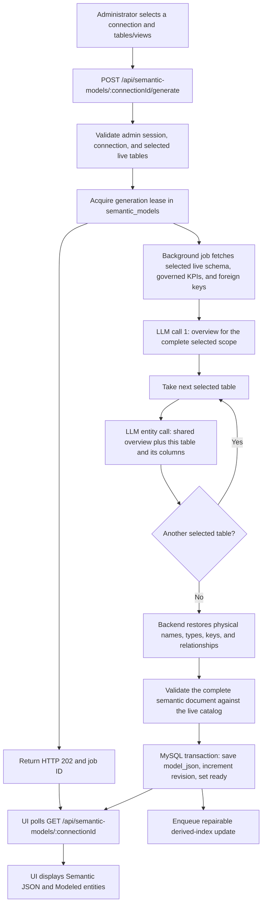

# ANONYMOUS_AI Current Workflow

This document covers only the active database-connection and per-connection
semantic-model flow. MySQL is the source of truth. Qdrant is the fixed vector
database and is always a derived, repairable index.

## Non-negotiable UI rule

All current and future UI work must preserve the established application theme:

- primary teal `#0ca1b6`;
- warm page background `#f5f4f1`;
- white surfaces;
- the existing CSS variables, typography, spacing, radii, shadows, breakpoints,
  responsive sidebar, and interaction patterns;
- the existing light color scheme.

Do not introduce a separate visual system or arbitrary replacement colors. New
Semantic Model states may use the existing semantic success, warning, and error
colors, but the page structure and controls must continue to use the shared theme.

## Authoritative storage

The metadata database is `autonomous_db`.

It stores:

- database connections in `db_connections`;
- one semantic model per connection in `semantic_models`;
- durable Qdrant work in `semantic_vector_outbox`;
- users, sessions, roles, ownership, and audit fields.

The old combined `semantic_model_doc` and `semantic_model_part_bindings` tables no
longer exist. There is no combined document, `parts` array, or bare numeric
connection pointer in public semantic JSON.

## 1. Sign in and create a database connection

An administrator signs in through the profile control and opens:

```text
Layer -> Database Connections
```

The administrator creates a connection with its label, database type, host,
logical database/schema scope, username, and secret. The backend verifies the
connection before saving it.

Secrets are encrypted at rest and are never returned by connection-list APIs,
placed in semantic JSON, sent to the semantic-generation model, added to Qdrant,
or written to tracked documentation.

Each saved connection receives two identifiers:

- `id`: an internal numeric MySQL key used by API routes and foreign keys;
- `semantic_key`: a stable public semantic identifier such as
  `mysql_supply_chain`.

The semantic key is unique, receives a suffix when a collision occurs, and does
not change when the connection label is renamed.

## 2. Inspect the live catalog

The Semantic Model tab loads the selected connection's tables and views from:

```http
GET /api/data-catalog/:connectionId
```

Catalog discovery reads the live database. It supplies exact table names, column
names, datatypes, primary keys, and foreign-key relationships. These physical
fields are authoritative and cannot be invented or changed by the LLM.

The user can search the catalog, select individual tables/views, select all, or
clear the selection.

## 3. Generate one semantic model for one connection

The current generation endpoint is:

```http
POST /api/semantic-models/:connectionId/generate
```

Full generation body:

```json
{
  "tables": ["orders", "customers", "products"],
  "mode": "full"
}
```

Append body:

```json
{
  "tables": ["shipments"],
  "mode": "append"
}
```

The API first verifies the connection and selected live tables, then accepts the
background job with HTTP `202`. Only one generation lease may be active for a
connection. A competing write receives `409 MODEL_BUSY`.

### Generation stages

1. The backend verifies the selected tables against the live catalog.
2. It acquires a generation lease for the selected connection and returns the job
   ID to the UI.
3. The background job loads only safe context: connection label/type/logical
   scope, selected live schema, governed KPI descriptions, and selected foreign
   keys.
4. Pass 1 makes one structured LLM call for an application overview of the entire
   selected scope.
5. Pass 2 walks the selected table list sequentially and makes one structured LLM
   call for the current table. Every call receives that table's exact columns plus
   the shared overview and table role from Pass 1. A measured
   provider context/format failure is the only condition that enables bounded
   wide-table chunking.
6. The backend restores the exact table names, exact column names, live datatypes,
   live primary keys, stable datasource identity, and deterministic relationships.
7. The complete document is schema-validated. Unknown tables/columns, unsafe
   measure expressions, duplicate entities, invalid relationships, and modified
   deterministic fields are rejected.
8. MySQL atomically saves the new revision and enqueues its derived-index update in the
   same transaction.
9. The UI polls the model endpoint while generation is active, then renders the
   saved JSON and modeled entities when the status becomes `ready`.

### Exact call, generation, and storage flow



### Where the generated schema is stored

The generated result is not kept only in browser state or model memory. MySQL is
the permanent source of truth:

- table: `semantic_models`;
- row identity: `connection_id` (one row per saved database connection);
- document: `model_json`, a serialized complete semantic JSON document;
- control fields: `status`, `revision`, generation lease/error fields, and audit
  timestamps/users.

The JSON contains the datasource identity, model/domain description, every
generated entity, its physical table, dimensions, measures, primary keys, and the
deterministically rebuilt relationships. A derived vector copy may be rebuilt from
this MySQL document and is not required to recover the semantic model.

### How the AI understands tables one by one

The model does not permanently remember a previous generation request. Its shared
understanding is passed explicitly:

1. The overview call sees all selected table schemas together and returns the
   common model name, domain, description, and a role for each selected table.
2. The backend then iterates tables in order. Each entity call sees only the
   current table's exact columns plus the shared overview and that table's role.
3. The backend joins the returned entity drafts, restores authoritative physical
   metadata, computes relationships from live foreign keys, validates the result,
   and stores the complete JSON in MySQL.
4. Later requests load the saved JSON again when semantic business context is
   needed; understanding comes from the stored document, not hidden LLM memory.

### Folder and file responsibility map

No source file is generated when a semantic model finishes. The application saves
runtime records in MySQL. The following tracked source files implement the flow:

```text
frontend/src/
|-- api/services.js
`-- components/pages/semanticLayer/
    |-- SemanticTab.jsx
    |-- TabsHeader.jsx
    `-- tabs/
        |-- DatabaseConnections.jsx
        `-- SemanticModelManager.jsx

backend/
|-- migrations/001_init.sql
`-- src/
    |-- main.ts
    |-- server.ts
    |-- db/connection.ts
    |-- routes/router.ts
    |-- routes/semanticLayer/
    |   |-- connections.ts
    |   |-- dataCatalog.ts
    |   `-- semanticModels.ts
    |-- semanticModels/
    |   |-- datasource.ts
    |   |-- generator.ts
    |   |-- jobs.ts
    |   |-- relationships.ts
    |   |-- schema.ts
    |   |-- store.ts
    |   `-- vectorOutboxWorker.ts
    `-- vector/
        |-- config.ts
        |-- embeddings.ts
        `-- qdrant.ts
```

#### Frontend files

| File | Responsibility |
| --- | --- |
| `frontend/src/components/pages/semanticLayer/SemanticTab.jsx` | Owns the active connection ID shared by the Semantic Layer screens and persists it in browser storage. |
| `frontend/src/components/pages/semanticLayer/TabsHeader.jsx` | Renders the currently enabled Database Connections, Semantic Models, and KPI Definitions navigation. |
| `frontend/src/components/pages/semanticLayer/tabs/DatabaseConnections.jsx` | Creates, lists, tests, renames, and deletes saved database connections. |
| `frontend/src/components/pages/semanticLayer/tabs/SemanticModelManager.jsx` | Loads the live catalog and saved model, submits generation operations, polls job state, displays/edits Semantic JSON, and renders the table and modeled-entity panels. |
| `frontend/src/api/services.js` | Axios boundary for `/api/connections`, `/api/data-catalog`, and `/api/semantic-models` calls. It attaches the API key and authenticated browser session. |

#### Backend request and generation files

| File | Responsibility |
| --- | --- |
| `backend/src/server.ts` | Creates the Express app and applies the larger JSON-body limit required by semantic-model saves. |
| `backend/src/routes/router.ts` | Mounts the connection, data-catalog, and semantic-model routers under `/api`. |
| `backend/src/routes/semanticLayer/connections.ts` | Validates connection input, tests access, encrypts secrets, assigns the stable semantic key, and writes `db_connections`. |
| `backend/src/routes/semanticLayer/dataCatalog.ts` | Connects to the selected live database and returns its exact tables, views, columns, datatypes, keys, and relationships. |
| `backend/src/routes/semanticLayer/semanticModels.ts` | HTTP contract for loading, generating, appending, regenerating, removing, and manually saving a connection model. |
| `backend/src/semanticModels/jobs.ts` | Acquires the generation lease, returns the accepted job ID, runs the background operation, and records safe failures. |
| `backend/src/semanticModels/generator.ts` | Builds safe generation context, performs the overview call and sequential per-table entity calls, and normalizes each entity against live metadata. |
| `backend/src/semanticModels/datasource.ts` | Builds the safe datasource block using the stable semantic key and logical database/catalog/schema scope; secrets are excluded. |
| `backend/src/semanticModels/relationships.ts` | Rebuilds relationships deterministically from modeled entities and live foreign keys. |
| `backend/src/semanticModels/schema.ts` | Defines the semantic JSON schema and rejects invented or modified physical fields and unsafe content. |
| `backend/src/semanticModels/store.ts` | Loads and transactionally saves `semantic_models.model_json`, enforces revisions/leases, and creates the durable derived-index outbox job. |

#### Storage and derived-index files

| File | Responsibility |
| --- | --- |
| `backend/src/db/connection.ts` | Shared metadata-MySQL pool used for connections, models, revisions, and outbox records. |
| `backend/migrations/001_init.sql` | Fresh-install schema containing `db_connections`, `semantic_models`, and `semantic_vector_outbox`. |
| `backend/src/main.ts` | Verifies metadata MySQL, recovers interrupted generation state, starts the HTTP server, and starts/stops the outbox worker. |
| `backend/src/semanticModels/vectorOutboxWorker.ts` | Claims durable outbox work and synchronizes the saved MySQL model into the repairable derived index. Generation remains successful if this later step fails. |
| `backend/src/vector/config.ts` | Validates derived-index collection, embedding dimension, URLs, and timeouts. |
| `backend/src/vector/embeddings.ts` | Creates the bounded embedding text and requests the local embedding vector. |
| `backend/src/vector/qdrant.ts` | Creates/checks the collection and performs point upsert/delete operations. |

The main source call path is:

```text
SemanticModelManager.jsx
  -> api/services.js
  -> routes/router.ts
  -> routes/semanticLayer/semanticModels.ts
  -> semanticModels/jobs.ts
  -> semanticModels/generator.ts
  -> semanticModels/schema.ts + relationships.ts
  -> semanticModels/store.ts
  -> MySQL semantic_models.model_json
```

The independent derived-index path is:

```text
semanticModels/store.ts
  -> MySQL semantic_vector_outbox
  -> semanticModels/vectorOutboxWorker.ts
  -> vector/embeddings.ts
  -> vector/qdrant.ts
```

### Runtime records and optional exported files

| Artifact | Created when | Purpose |
| --- | --- | --- |
| `db_connections` row | An administrator saves a connection | Stores the encrypted connection configuration and stable semantic key. |
| `semantic_models` row | Generation starts; updated when generation succeeds | Stores job state and the authoritative complete `model_json` document for that connection. |
| `semantic_vector_outbox` row | A model revision is saved or a connection is deleted | Durable retry work for the derived index; removed after successful processing. |
| Derived vector point | The outbox worker completes | Search/index copy that can be rebuilt from MySQL. |
| `<semantic_key>.json` download | A user explicitly clicks **Export** | Optional browser download of the JSON currently shown in the editor. |

Normal generation does **not** create a JSON file inside the repository, one file
per table, or a hidden model file on the backend filesystem. The complete model is
one MySQL JSON document; only an explicit UI export creates a downloadable file.

If generation fails, the previous valid MySQL model remains visible and only the
generation state/error changes.

## 4. Current semantic JSON format

Every connection owns one standalone document. A typical MySQL/PostgreSQL model
looks like this:

```json
{
  "version": "1.0",
  "model_name": "SupplyChain",
  "domain": "Supply Chain",
  "description": "Semantic model for supply-chain operations",
  "datasource": {
    "connection_id": "mysql_supply_chain",
    "database_name": "supply_chain"
  },
  "entities": [
    {
      "name": "Order",
      "table_name": "orders",
      "description": "Customer orders placed with the company",
      "primary_keys": ["order_id"],
      "dimensions": [
        {
          "name": "Order Date",
          "column_name": "order_date",
          "datatype": "date",
          "description": "Date on which the order was placed"
        }
      ],
      "measures": [
        {
          "name": "Order Amount",
          "expression": "order_amount",
          "aggregation": "sum",
          "datatype": "decimal",
          "format": "currency",
          "description": "Total monetary value of orders"
        }
      ]
    }
  ],
  "relationships": []
}
```

`datasource.connection_id` is the stable semantic key. It is not the internal
numeric connection ID and will never be the bare value `"1"`.

The document deliberately excludes hostnames, usernames, passwords, tokens,
private keys, and provider credentials.

### Databricks datasource example

```json
{
  "connection_id": "databricks_supply_chain",
  "database_name": "supply_chain",
  "catalog": "main",
  "schema": "supply_chain"
}
```

In Databricks, `catalog` is the top-level namespace that contains schemas. `main`
is a common catalog name, not a universal hard-coded value. The saved connection
scope determines the actual catalog and schema.

## 5. Incremental model operations

### Full Generate

- Replaces the current model with exactly the selected tables/views.
- Requires confirmation when existing entities would be removed.
- Runs one overview pass and one entity-authoring pass per selected table.

### Add selected tables

- Uses `mode: "append"`.
- Generates only selected tables missing from the current model.
- Preserves every existing entity unchanged.

### Regenerate one table

```http
POST /api/semantic-models/:connectionId/regenerate-table
```

```json
{
  "table": "orders",
  "revision": 4
}
```

Only the selected entity is re-authored. Other entities remain unchanged and
relationships are rebuilt deterministically.

### Remove one table

```http
DELETE /api/semantic-models/:connectionId/tables
```

```json
{
  "table": "orders",
  "revision": 4
}
```

Removal requires confirmation, calls no LLM, removes the selected entity, and
rebuilds relationships.

### Review and save JSON

```http
PUT /api/semantic-models/:connectionId
```

```json
{
  "model": {},
  "revision": 4
}
```

Administrators may edit descriptive fields. The datasource, physical identities,
datatypes, primary keys, and relationships are backend-owned. Saves use optimistic
revisions; a stale edit receives `409 STALE_MODEL_REVISION`, and the UI reloads the
newer model instead of overwriting it.

## 6. Status and recovery

Read the current connection model with:

```http
GET /api/semantic-models/:connectionId
```

The response reports independent states:

- generation: `none`, `generating`, `ready`, or `error`;
- vector: `not_indexed`, `pending`, `ready`, or `error`.

It also includes the current revision, generation job, safe errors, timestamps,
generating user, creator, and last editor.

MySQL remains usable when Qdrant or Ollama is unavailable. A failed vector update
does not roll back or hide the MySQL model. An administrator retries indexing with:

```http
POST /api/semantic-models/:connectionId/retry-vector-sync
```

The outbox worker uses leased jobs, bounded retries, capped exponential backoff,
superseded-revision protection, and durable delete operations. Deleting a database
connection queues the Qdrant delete in the same transaction before the MySQL
connection row is removed.

## 7. Roles

- `admin`: create, rename, and delete connections; generate, append, regenerate,
  remove, edit, save, and retry semantic models; manage users.
- `user`: read connections, catalogs, and semantic models. The Semantic Model tab
  shows read-only content and no write controls.

Every API route still requires the configured API key. User operations additionally
require a valid HttpOnly session and trusted browser origin. Client-supplied user ID
headers are not trusted.

## 8. Local Qdrant and Ollama

No sign-in or hosted account is required. The pinned local services are free to run
under their respective open-source licenses and listen only on localhost.

Start them from the repository root:

```powershell
docker compose up -d
docker compose ps
```

Services:

- Qdrant `v1.18.2`: `http://127.0.0.1:6333`;
- Ollama `0.32.0`: `http://127.0.0.1:11434`;
- one-shot `ollama-init`: pulls `nomic-embed-text:v1.5` and exits successfully.

Health checks:

```powershell
Invoke-RestMethod http://127.0.0.1:6333/collections
Invoke-RestMethod http://127.0.0.1:11434/api/tags
Invoke-RestMethod http://127.0.0.1:3005/readyz
```

The readiness response reports MySQL, Redis, Qdrant, and embeddings separately.
Qdrant/Ollama failure produces a degradable readiness state; it does not make
MySQL CRUD unavailable.

Persistence uses the named volumes `anonymous_ai_qdrant_data` and
`anonymous_ai_ollama_data`. Normal container replacement does not remove them.

Safe shutdown:

```powershell
docker compose stop
```

Restart:

```powershell
docker compose start
```

Do not use `docker compose down -v` unless permanent deletion of both local volumes
is explicitly intended.

### Backup

The required backup is the authoritative `autonomous_db` MySQL database. Qdrant is
derived and can be rebuilt from MySQL with the retry-vector-sync operation.

An optional Qdrant collection snapshot can be created with:

```powershell
Invoke-RestMethod -Method Post http://127.0.0.1:6333/collections/semantic_models/snapshots
```

Store database backups and copied snapshots outside the repository. Do not commit
credentials or environment-specific data.

## 9. Local application setup

Backend environment essentials:

```env
DB_NAME=autonomous_db
SESSION_COOKIE_NAME=ai_session
SESSION_TTL_HOURS=8
QDRANT_URL=http://localhost:6333
QDRANT_COLLECTION=semantic_models
QDRANT_TIMEOUT_MS=10000
EMBEDDINGS_BASE_URL=http://localhost:11434/v1
EMBEDDINGS_MODEL=nomic-embed-text:v1.5
EMBEDDINGS_DIM=768
EMBEDDINGS_TIMEOUT_MS=30000
```

Keep real secrets only in the untracked local `.env` file.

Apply migrations and start development services:

```powershell
npm.cmd run migrate --prefix backend
npm.cmd run dev --prefix backend
npm.cmd run dev --prefix frontend
```

The backend defaults to `3005`; Vite defaults to `5173` and proxies `/api` to the
backend. Run only one backend process. If port 3005 is already in use, keep the
healthy existing backend or stop it before starting another terminal.

New installations use the single current-schema baseline
`backend/migrations/001_init.sql`. It creates only the runtime authentication,
connection, KPI, conversation, telemetry, semantic-model, vector-outbox, and
migration-ledger tables.

For a new installation, create the first administrator only with temporary local
environment values:

```powershell
$env:BOOTSTRAP_ADMIN_USERNAME="your-admin-name"
$env:BOOTSTRAP_ADMIN_PASSWORD="use-a-strong-local-secret"
npm.cmd run bootstrap:admin --prefix backend
Remove-Item Env:BOOTSTRAP_ADMIN_USERNAME
Remove-Item Env:BOOTSTRAP_ADMIN_PASSWORD
```

Never add the bootstrap password to a tracked file, command log, test fixture, or
documentation example containing a real value.

## 10. Verification

Run the active suite and the implementation integration bundle:

```powershell
npm.cmd run test
npm.cmd run test:implementation
npm.cmd run build
npm.cmd run lint
docker compose ps
```

The current schema and fresh-install baseline can be checked independently with:

```powershell
npm.cmd run verify:schema --prefix backend
npm.cmd run test:schema --prefix backend
```

Verification must report only `001_init.sql`, exactly 14 runtime tables, and no
legacy Summary, combined-model, copy-audit, or raw KPI inclusion/exclusion fields.

## Next steps

1. The current local `admin` and `user` accounts and historical audit/ownership
   backfill are complete. Rotate the initial local passwords before using this
   environment outside isolated development.
2. Sign in as the administrator and open `Layer -> Semantic Models`.
3. For `mysql_zepto`, select the required tables/views and choose Full Generate.
4. Repeat for `mysql_gsconnectdev`, or intentionally leave it in `none` if it must
   not be modeled yet.
5. Wait until generation is `ready`. If vector status becomes `error`, keep using
   the MySQL model and choose Retry vector sync after Qdrant/Ollama are healthy.
6. Review the generated JSON, verify business names/descriptions/measures, and save
   descriptive corrections using the current revision.
7. Keep every future Semantic Model UI change inside the established teal,
   warm-background, white-surface theme and repeat desktop/mobile visual QA.
